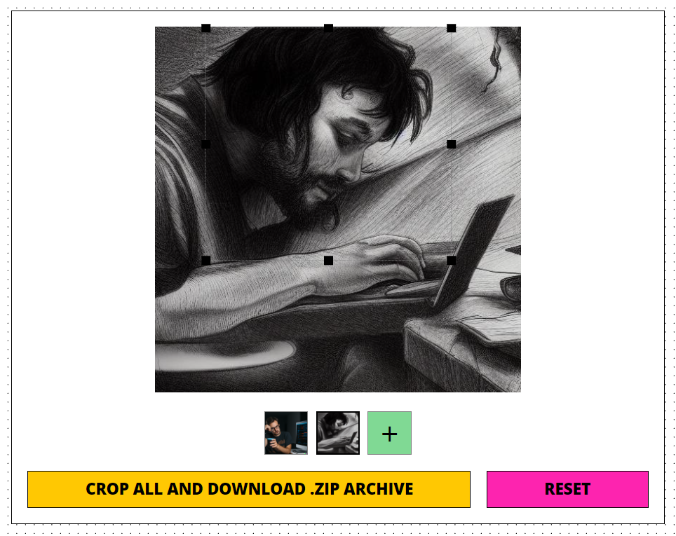

# PhotoCrop — пример реализации обрезки изображений

Стек: TypeScript, React, SCSS, Vite, Jest, Express, Multer, Sharp.
Конфиг: dotenv
Тулсет: ESLint, Prettier, Husky, lint-staged

## Описание

Приложение позволяет загрузить изображение и обрезать его. После обрезки можно сохранить результат в виде изображения.



# Инструкции
Рекомендуется использовать пакетный менеджер Yarn, но можно использовать и npm. В репозитории добавлен файл настройки `.yarnrc.yml` устанавливающий `nodeLinker` в значение `node-modules`. Это позволяет установить зависимости в папку `node_modules` вместо папки `.yarn`. Это сделано для удобства работы с Vite.

## Запуск (сначала backend, потом frontend)

Сервер по-умолчанию запускается на порту 3000. При необходимости можно изменить порт в файле `.env`.
Фронтенд проксирует запросы на сервер. По-умолчанию проксируется на `http://localhost:3000`, изменить можно в файле `vite.config.ts`.

```bash
npm install
npm run dev
```

## Сборка

```bash
npm run build
```

## Тесты (только на фронте)

```bash
npm run test
```

# Структура проекта

```
.
├── backend/ - сервер
│   ├── .uploads/ [Папка для загруженных изображений]
│   ├── .bin/
│   │   ├── clear.sh [Скрипт для очистки папки .uploads]
│   ├── src/
│   │   ├── lib/
│   │   │   ├── types.ts [Типы и схемы Joi для валидации запросов]
│   │   │   └── image.ts [Реализация обрезки изображения через Sharp]
│   │   ├── routes/
│   │   │   ├── crop.ts [Реализация ручки для обрезки изображения]
│   │   ├── config.ts [Конфигурация сервера]
│   │   ├── global.d.ts [Расширение глобального объекта Node.js для поддержки process.env]
│   │   └── index.ts [Express сервер]
│   ├── .env
│   ├── api.yaml [Спецификация API]
├── frontend/ - клиент
│   ├── tests/
│   │   ├── box.test.ts [Тесты для box.ts]
│   ├── src/
│   │   ├── styles/
│   │   │   ├── _variables.scss [Переменные SCSS]
│   │   ├── utils/
│   │   │   ├── box.ts [Реализация математики для обрезки изображения]
│   │   ├── components/
│   │   │   ├── App/
│   │   │   │   ├── App.tsx [Собранный кроппер]
│   │   ├── index.scss [Глобальные стили]
│   │   ├── main.tsx [Точка входа]
│   ├── .env
│   └── vite.config.ts [Конфигурация Vite + Proxy на сервер]
└── README.md
```

# Структура API

```
POST /crop
  Загружает изображение и обрезает его
  Request:
    body:
      photo: File [Изображение для обрезки]
      x: number [Координата x]
      y: number [Координата y]
      width: number [Ширина]
      height: number [Высота]
  Response:
    200:
      body:
        image: binary [Изображение как attachment для скачивания]
    400:
      body:
        message: string [Сообщение об ошибке валидации от Joi]
```

# Структура компонент UI (C3)

```
App [Сборка кроппера]
  FileUpload(value, onChange) [Загрузка изображения]
    DropZone(isDragging, error, onDrop, onChange) [Зона для перетаскивания]
  ImagePreview(file) [Предпросмотр изображения]
  Resizer(value, onChange) [Редактор для обрезки]
  Actions(items) [Кнопки для сохранения и сброса]
```

# Известные проблемы и что можно улучшить

1. Слабая обработка ошибок на сервере. В случае ошибки сервер просто падает.
2. Нет обработки ошибок на фронте. В случае ошибки сервера пользователь не получит никакого уведомления.
3. Нет прогресса загрузки изображения. Пользователь не видит, что изображение загружается если оно большое.
4. Нет массовой обрезки изображений. Возможно добавить возможность загрузить несколько изображений и обрезать их по очереди или скачать результирующим архивом.
5. Нужно завернуть сервер в Docker контейнер для удобства последующего деплоя.